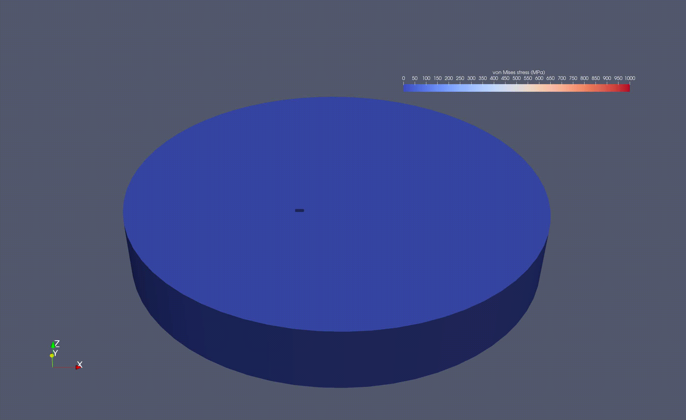
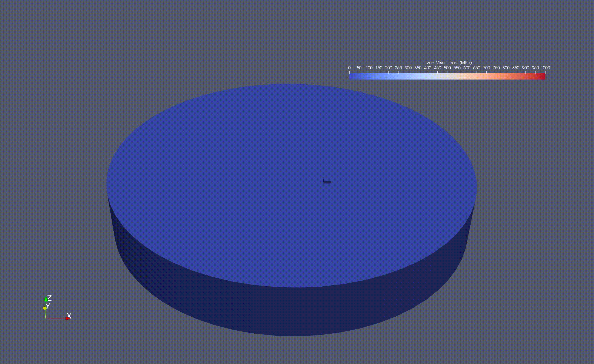

# AM Thermomechanical Solver
A GPU-accelerated FEM solver for residual stress simulation in additive manufacturing using CuPy

**Authors:**
Shuheng Liao, Ashkan Golgoon

Additional programming by Rujing Zha and Anthony Goeckner.

**Paper:**
Liao, S., Golgoon, A., Mozaffar, M., & Cao, J. (2023). Efficient GPU-accelerated thermomechanical solver for residual stress prediction in additive manufacturing. Computational Mechanics, 71(5), 879-893.

**Example results:**
<p align="middle">
  
</p>
<p align="middle">
  
</p>


# Installation Instructions

1) Install Conda according to instructions in [the Conda documentation](https://docs.conda.io/en/latest/miniconda.html).

2) Create a Conda environment initialized with Python 3.10:
   ```
   conda create -n gamma python=3.10
   ```

3) Activate the Conda environment.
   ```
   conda activate gamma
   ```

4) Install all prerequisites. We require the following:
    * numba
    * pandas
    * scikit-learn
    * cupy
    * pyvista
    * pyvirtualdisplay
    * zarr

   All of the listed prerequisites may be installed easily using `conda`, as seen below:
   ```bash
   conda env update -f ./environment.yml
   ```

5) Install the `gamma` package:
   ```bash
   pip install -e .
   ```


# Usage Instructions

After installing GAMMA using the [Installation Instructions](#installation-instructions) above, import the GAMMA interface in your project as follows:

```python
from gamma.interface import FeaModel
```

Then use the `FeaModel` class to run the simulation.